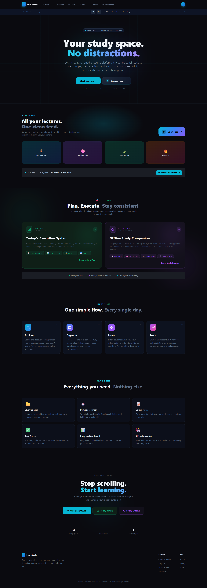
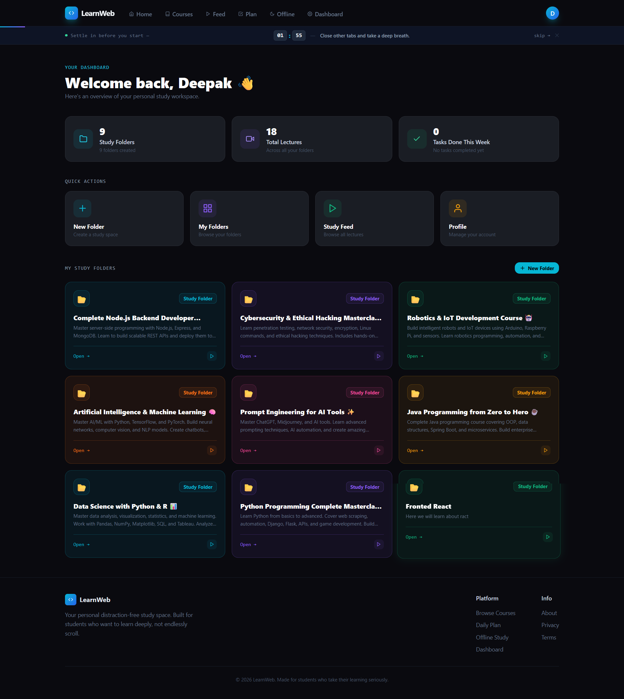
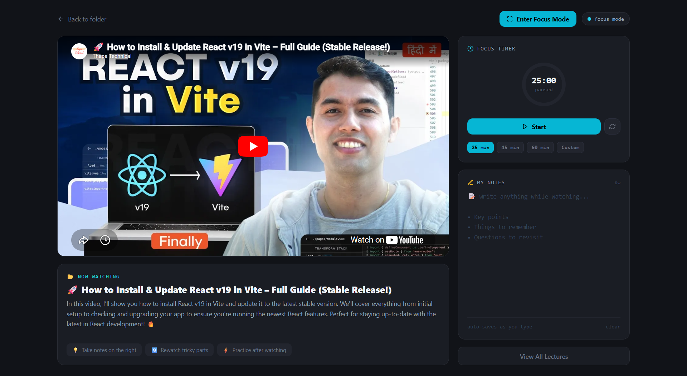
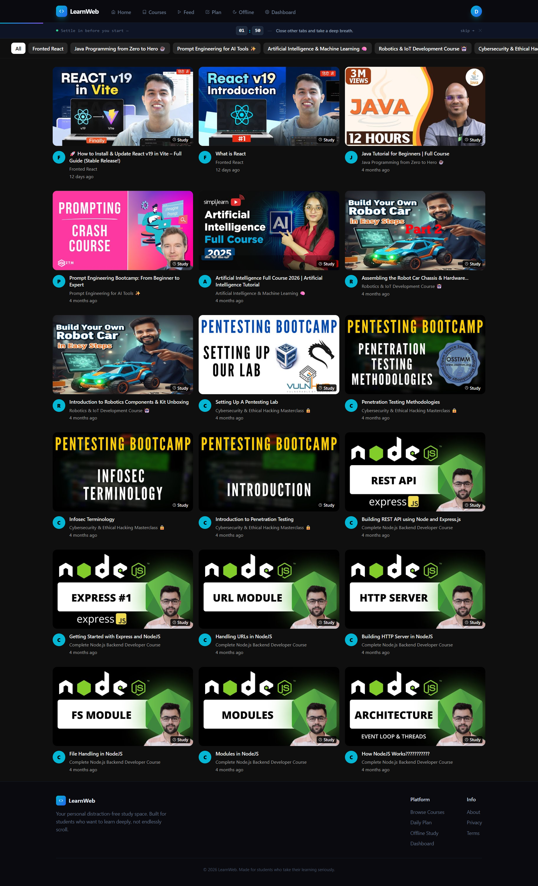
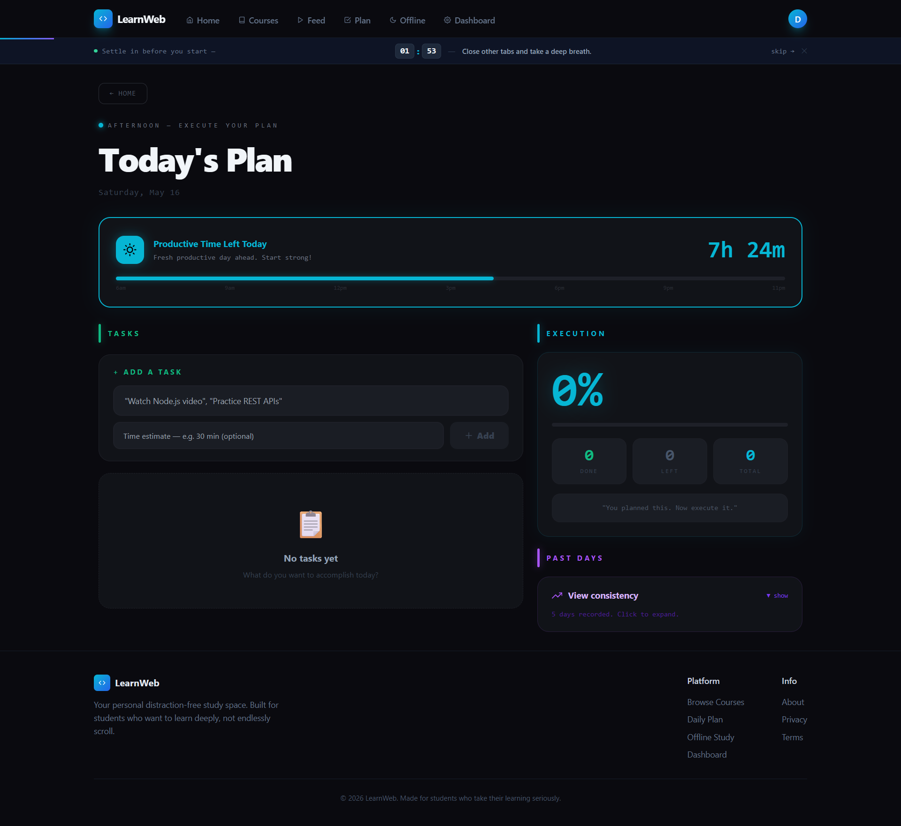
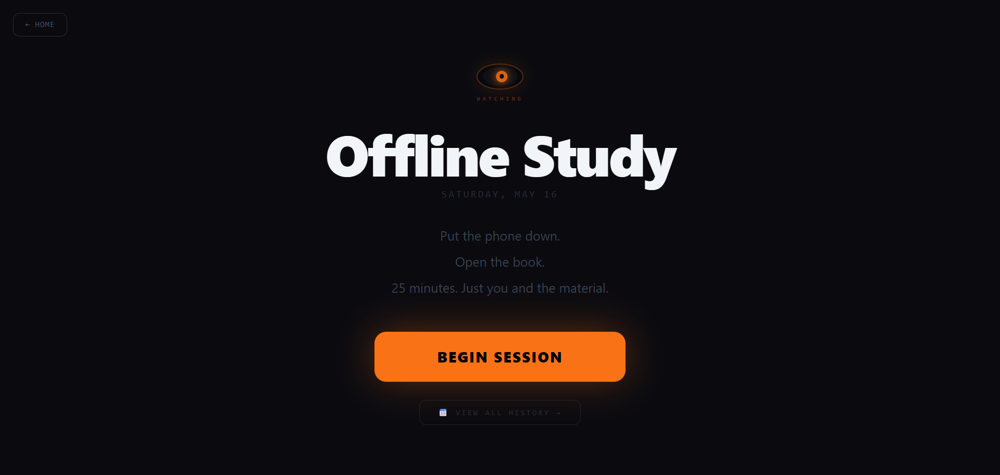

<div align="center">

# LearnWeb

**A personal, distraction-free study platform built for students who take learning seriously.**

[](https://learnweb-fawn.vercel.app/)
[](https://learnweb-backend.onrender.com/api/health)
[](https://www.mongodb.com/atlas)
[](./LICENSE)

<br/>

> No ads. No recommendations. No infinite scroll.  
> Just you, your study material, and your progress.

<br/>

[🚀 Live Demo](https://learnweb-fawn.vercel.app/) · [📖 API Docs](#api-overview) · [🐛 Report Bug](https://github.com/deepak-dev-24/learnweb/issues) · [✨ Request Feature](https://github.com/deepak-dev-24/learnweb/issues)

</div>

---

## 📸 Screenshots

> _Screenshots coming soon — add images to `/docs/screenshots/` and update paths below._

| Landing Page | Dashboard | Video Player |
|---|---|---|
|  |  |  |

| Study Feed | Daily Plan | Offline Study |
|---|---|---|
|  |  |  |

---

## 📌 About The Project

**LearnWeb** is not a course marketplace or an LMS. It is a **private, personal study workspace** designed for students who want to learn deeply without distractions.

The core idea is simple — modern learning platforms are designed to keep you scrolling, not studying. LearnWeb is the opposite: a focused environment where you organize your own material, watch lectures distraction-free, track every study session, and stay accountable to yourself.

### Core Philosophy

- 🔒 **Private by default** — every folder, lecture, and session belongs only to you
- 🚫 **Zero distractions** — no ads, no recommendations, no infinite scroll
- ⏱️ **Focus-first design** — Pomodoro timers and focus modes built into the study experience
- 📊 **Progress-aware** — every session, task, and completed lecture is tracked

---

## ✨ Features

### 📁 Study Folders
- Create personal subject folders (DSA, Backend, Java, etc.)
- Upload custom thumbnails via Cloudinary
- Circular progress ring shows lecture completion percentage
- Per-folder goals saved locally for quick reference
- Edit and delete folders with ownership enforcement

### 🎬 Lecture Management & Video Player
- Add YouTube lectures to any folder
- Distraction-free video player with no navbar or footer
- Supports YouTube, Vimeo, and MP4/WebM formats
- **Focus Mode** — fullscreen video with nothing else on screen
- **Pomodoro Timer** — 25 / 45 / 60 min presets + custom duration
- Idle detection after 90 seconds of inactivity
- Tab-switch warning when you leave the video
- **Notes panel** — auto-saves to localStorage as you type, per-lecture
- Mark lectures complete / incomplete (tracked per user)

### 📺 Study Feed
- YouTube-style grid of all your lectures across all folders
- Filter by folder name
- Real YouTube thumbnails auto-extracted from video URL
- Click any lecture to jump directly into the video player

### ✅ Daily Plan
- Create daily study tasks with text and time estimates
- Mark tasks complete with timestamps
- Visual progress bar and completion statistics
- Confetti celebration when all tasks are done
- 14-day task history with expandable day cards

### ⏱️ Offline Study (Pomodoro System)
- 25-minute focused study sessions with 5-minute breaks
- Animated SVG clock ring with particle effects
- "Watching Eye" — animated presence to maintain focus accountability
- Motivational instructor messages appear every 5 minutes
- Tab-switch detection with a warning banner
- After each session — reflection form:
  - What did you study? (free text)
  - How focused were you? (Fully / Mostly / Not really)
- Session data saved to database
- Up to 4 sessions before auto-summary
- Full study journal at `/study-history`

### 📊 Dashboard
- Real-time stats: folder count, total lectures, tasks completed this week
- Quick action buttons for all major features
- Personal study folder grid preview

### 👤 Profile & Auth
- JWT-based authentication with 7-day token expiry
- Password reset via name + email verification
- Persistent login across page refreshes
- Clean profile page with account stats

---

## 🛠️ Tech Stack

### Frontend
| Technology | Purpose |
|---|---|
| [React 18](https://react.dev/) | UI framework |
| [Vite](https://vitejs.dev/) | Build tool and dev server |
| [Redux Toolkit](https://redux-toolkit.js.org/) | Global state management (6 slices) |
| [React Router v6](https://reactrouter.com/) | Client-side routing |
| [Axios](https://axios-http.com/) | HTTP client with auth interceptor |
| [Tailwind CSS](https://tailwindcss.com/) | Utility-first styling |
| [React Icons](https://react-icons.github.io/react-icons/) | Icon library |

### Backend
| Technology | Purpose |
|---|---|
| [Node.js](https://nodejs.org/) | Runtime environment |
| [Express.js](https://expressjs.com/) | REST API framework (CommonJS) |
| [MongoDB Atlas](https://www.mongodb.com/atlas) | Cloud database |
| [Mongoose](https://mongoosejs.com/) | ODM for schema modeling |
| [JSON Web Token](https://jwt.io/) | Authentication |
| [bcryptjs](https://github.com/dcodeIO/bcrypt.js) | Password hashing |
| [Cloudinary](https://cloudinary.com/) | Image/media storage |
| [Morgan](https://github.com/expressjs/morgan) | HTTP request logging |

### Deployment
| Service | Purpose |
|---|---|
| [Vercel](https://vercel.com/) | Frontend hosting |
| [Render](https://render.com/) | Backend API hosting |
| [MongoDB Atlas](https://www.mongodb.com/atlas) | Database hosting |

---

## 🏗️ Architecture Overview

```
LearnWeb/
├── client/                          # React + Vite frontend
│   ├── public/
│   └── src/
│       ├── components/
│       │   ├── ImageUpload.jsx      # Cloudinary upload component
│       │   ├── Layout.jsx           # Passthrough layout wrapper
│       │   └── ProtectedRoute.jsx   # JWT-based route guard
│       ├── features/                # Redux Toolkit slices
│       │   ├── auth/authSlice.js
│       │   ├── folder/folderSlice.js
│       │   ├── lectures/lectureSlice.js
│       │   ├── feed/feedSlice.js
│       │   ├── plan/planSlice.js
│       │   └── studySession/studySessionSlice.js
│       ├── lib/
│       │   └── api.js               # Axios instance + token injection
│       ├── pages/                   # 14 application pages
│       │   ├── Dashboard.jsx
│       │   ├── StudyFolders.jsx
│       │   ├── FolderDetail.jsx
│       │   ├── CreateFolder.jsx
│       │   ├── ManageFolder.jsx
│       │   ├── Lectures.jsx
│       │   ├── VideoPlayer.jsx
│       │   ├── Feed.jsx
│       │   ├── DailyPlan.jsx
│       │   ├── OfflineStudy.jsx
│       │   ├── StudyHistory.jsx
│       │   ├── Profile.jsx
│       │   ├── Login.jsx
│       │   └── Signup.jsx
│       ├── App.jsx                  # Routes + Navigation + Home page
│       ├── store.js                 # Redux store configuration
│       └── main.jsx                 # React entry point
│
└── server/                          # Node.js + Express backend
    └── src/
        ├── config/
        │   └── cloudinary.js        # Cloudinary SDK config
        ├── controllers/
        │   ├── auth.controller.js
        │   ├── course.controller.js
        │   ├── lecture.controller.js
        │   ├── plan.Controller.js
        │   └── studySession.Controller.js
        ├── middleware/
        │   └── auth.js              # requireAuth + requireRole
        ├── models/
        │   ├── User.js
        │   ├── Course.js
        │   ├── Lecture.js
        │   ├── Plan.js
        │   └── StudySession.js
        ├── routes/
        │   ├── auth.routes.js
        │   ├── course.routes.js
        │   ├── lecture.routes.js
        │   ├── feed.routes.js
        │   ├── plan.routes.js
        │   ├── studySession.Routes.js
        │   ├── file.routes.js
        │   └── health.routes.js
        ├── app.js                   # Express app + middleware + routes
        └── server.js                # HTTP server entry point
```

### Request Flow

```
Browser (React)
    │
    ├── Redux Thunk dispatched
    │
    └── Axios (lib/api.js)
            │  Authorization: Bearer <JWT>
            ▼
        Express API (Render)
            │
            ├── CORS → JSON parser → Morgan
            │
            ├── requireAuth middleware
            │   └── jwt.verify() → req.user = { id, role }
            │
            ├── Route handler → Controller
            │
            └── Mongoose → MongoDB Atlas
                    │
                    └── Response JSON → Redux state update → UI re-render
```

---

## 🗄️ Database Models

| Model | Key Fields | Purpose |
|---|---|---|
| `User` | `name`, `email`, `passwordHash`, `role` | Authentication and identity |
| `Course` | `title`, `description`, `thumbnail`, `createdBy` | Study folders per user |
| `Lecture` | `course`, `title`, `videoUrl`, `durationSec`, `completedBy[]` | Videos inside folders |
| `Plan` | `user`, `date`, `tasks[]`, `completedCount`, `totalCount` | Daily task planner |
| `StudySession` | `user`, `date`, `sessionNumber`, `duration`, `reflection`, `focusRating` | Offline Pomodoro sessions |

---

## 🔌 API Overview

All routes are prefixed with `/api`. Protected routes require `Authorization: Bearer <token>`.

### Auth
```
POST   /api/auth/signup            Register new account
POST   /api/auth/login             Login with email + password
POST   /api/auth/verify-reset      Verify identity for password reset
POST   /api/auth/reset-password    Set new password
```

### Study Folders (Courses)
```
GET    /api/courses                Get all folders for logged-in user
GET    /api/courses/:id            Get single folder (must be owner)
POST   /api/courses                Create new folder
PUT    /api/courses/:id            Update folder (must be owner)
DELETE /api/courses/:id            Delete folder (must be owner)
```

### Lectures
```
GET    /api/courses/:courseId/lectures                          Get all lectures in folder
POST   /api/courses/:courseId/lectures                          Add lecture (must own folder)
PUT    /api/courses/:courseId/lectures/:lectureId               Edit lecture
DELETE /api/courses/:courseId/lectures/:lectureId               Delete lecture
POST   /api/courses/:courseId/lectures/:lectureId/complete      Toggle complete/incomplete
```

### Feed
```
GET    /api/feed                   All lectures from user's own folders
```

### Daily Plan
```
GET    /api/plans/today            Get or auto-create today's plan
POST   /api/plans/task             Add task { text, estimate }
PATCH  /api/plans/task/:taskId     Toggle task complete
DELETE /api/plans/task/:taskId     Delete task
GET    /api/plans/history          Last 14 days of plans
```

### Offline Study Sessions
```
POST   /api/study-sessions         Save completed Pomodoro session
GET    /api/study-sessions/today   Get today's sessions
GET    /api/study-sessions/history Last 14 days grouped by date
```

### Files
```
POST   /api/files/upload           Upload image to Cloudinary
```

### Health
```
GET    /api/health                 Server health check
```

---

## 🚀 Getting Started

### Prerequisites

- Node.js `>= 18.0.0`
- npm or yarn
- MongoDB Atlas account (free tier works)
- Cloudinary account (free tier works)

### 1. Clone the Repository

```bash
git clone https://github.com/deepak-dev-24/learnweb.git
cd learnweb
```

### 2. Setup the Backend

```bash
cd server
npm install
```

Create a `.env` file in the `server/` directory:

```env
PORT=5000
MONGODB_URI=mongodb+srv://<username>:<password>@cluster.mongodb.net/learnweb
JWT_SECRET=your_strong_jwt_secret_here
CLIENT_URL=http://localhost:5173
CLOUDINARY_CLOUD_NAME=your_cloud_name
CLOUDINARY_API_KEY=your_api_key
CLOUDINARY_API_SECRET=your_api_secret
```

Start the backend server:

```bash
npm run dev
```

Server will run at `http://localhost:5000`

### 3. Setup the Frontend

```bash
cd ../client
npm install
```

Create a `.env` file in the `client/` directory:

```env
VITE_API_URL=http://localhost:5000/api
```

Start the frontend:

```bash
npm run dev
```

App will run at `http://localhost:5173`

### 4. Verify Setup

- Frontend: `http://localhost:5173`
- Backend health: `http://localhost:5000/api/health`
- Create an account and start building your first study folder

---

## 🌐 Deployment

### Frontend → Vercel

1. Push your code to GitHub
2. Import the repository in [Vercel](https://vercel.com/)
3. Set the **root directory** to `client`
4. Add environment variable:
```
   VITE_API_URL=https://your-backend.onrender.com/api
```
5. Deploy — Vercel handles the Vite build automatically

### Backend → Render

1. Create a new **Web Service** in [Render](https://render.com/)
2. Connect your GitHub repository
3. Set the **root directory** to `server`
4. Set build command: `npm install`
5. Set start command: `npm start`
6. Add all environment variables from `.env.example`
7. Deploy

### Database → MongoDB Atlas

1. Create a free cluster at [MongoDB Atlas](https://www.mongodb.com/atlas)
2. Create a database user with read/write access
3. Whitelist `0.0.0.0/0` for Render's dynamic IPs
4. Copy the connection string into `MONGODB_URI`

---

## 🔐 Authentication Flow

```
Signup / Login
      │
      ▼
POST /api/auth/signup or /login
      │
      ▼
Server issues JWT (expires in 7 days)
      │
      ▼
Frontend stores { user, token } in localStorage
      │
      ▼
authSlice loads from localStorage on every page refresh
      │
      ▼
setAuthToken(token) injects Bearer token into all Axios requests
      │
      ▼
requireAuth middleware verifies token on every protected route
      │
      ▼
req.user = { id, role } available in all controllers
```

---

## 🗺️ Application Modules

| Module | Pages | Description |
|---|---|---|
| Authentication | Login, Signup | JWT auth, password reset, session persistence |
| Study Folders | StudyFolders, FolderDetail, CreateFolder, ManageFolder | Personal subject organization |
| Lecture & Player | Lectures, VideoPlayer | Video watching with Pomodoro and notes |
| Study Feed | Feed | Unified grid of all personal lectures |
| Daily Plan | DailyPlan | Task management with 14-day history |
| Offline Study | OfflineStudy, StudyHistory | Pomodoro sessions with reflection journal |
| Dashboard & Profile | Dashboard, Profile | Stats overview and account management |

---

## 🔮 Future Improvements

- [ ] Edit profile (name and email update API)
- [ ] Lecture duration tracking and watch time analytics
- [ ] Weekly study streak visualization
- [ ] Mobile app (React Native)
- [ ] Keyboard shortcuts for Focus Mode
- [ ] Export study history as PDF
- [ ] Dark/light theme toggle
- [ ] Lecture reordering via drag and drop
- [ ] Email notification for daily plan reminders

---

## 👤 Author

**Deepak Kumar**

- GitHub: [@deepak-dev-24](https://github.com/deepak-dev-24)
- Live Project: [learnweb-fawn.vercel.app](https://learnweb-fawn.vercel.app/)

---

## 📄 License

This project is licensed under the **MIT License**.  
See the [LICENSE](./LICENSE) file for details.

---

## 🙏 Acknowledgements

- [React](https://react.dev/) and [Vite](https://vitejs.dev/) for the frontend foundation
- [MongoDB Atlas](https://www.mongodb.com/atlas) for free cloud database hosting
- [Cloudinary](https://cloudinary.com/) for media management
- [Vercel](https://vercel.com/) and [Render](https://render.com/) for free-tier deployment
- Every student who needs a distraction-free place to actually study

---

<div align="center">

**Built with focus. For students who mean it.**

⭐ Star this repository if LearnWeb helped you study better.

</div>